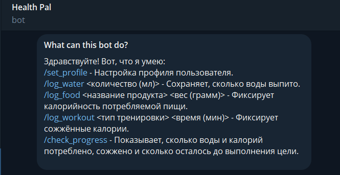
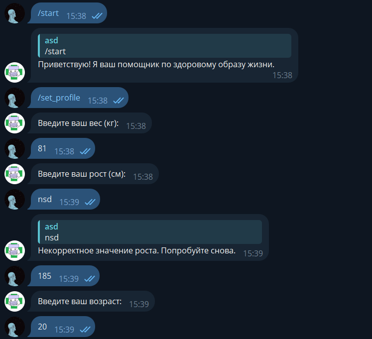
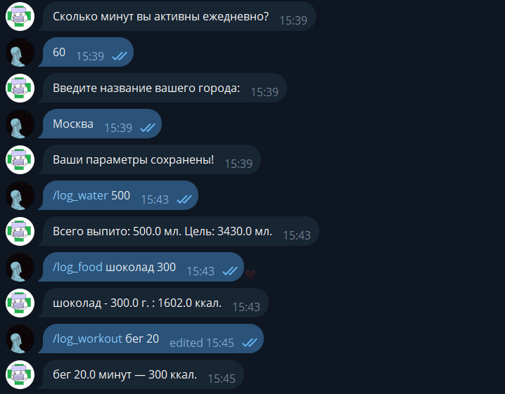
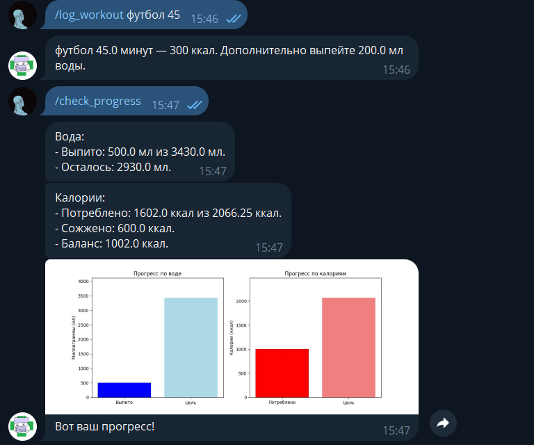
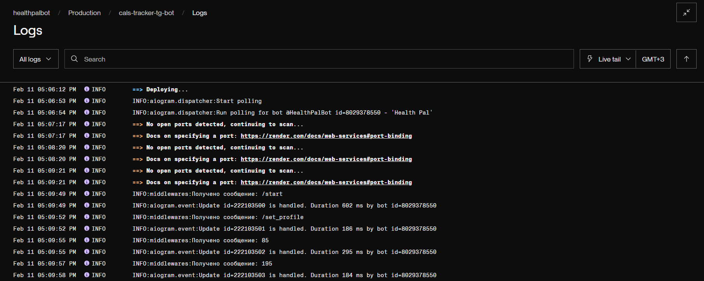
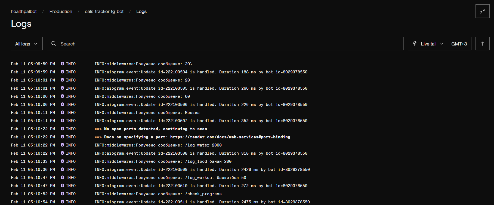

# Telegram-бот для расчёта нормы воды, калорий и трекинга активности
Телеграм-бот, который помогает рассчитать дневные нормы воды и калорий, а также отслеживать тренировки и питание.

## Технологии:

- **Programming Language**: Python 3.9
- **Telegram Bot Framework**: aiogram
- **Weather data source**: OpenWeatherMap API
- **Food Data Source**: OpenFoodFacts API
- **Deploy service**: render.com

## Функционал:

## Деплой бота на render.com:

